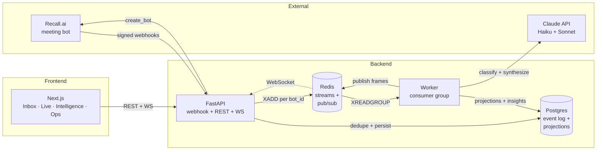
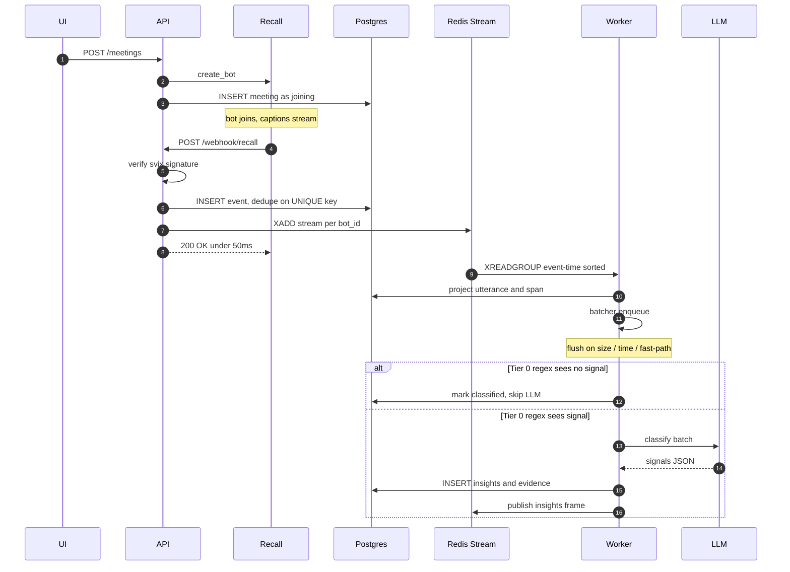

# Recall Mission Control

Live customer-call intelligence inbox built on [Recall.ai](https://recall.ai). A real bot joins a real Zoom/Meet/Teams call, transcript streams in, LLM signals surface while the call is live, and a deep ops view shows every webhook + every millisecond of latency — with a deterministic **Replay** button that rebuilds derived state from the event log.

Two audiences in one product:

- **Sales / CS rep** sees Inbox → Live Call → Intelligence card.
- **Infra engineer** opens **Mission Control** and sees the event timeline, webhook deliveries, latency waterfall, DLQ, and Replay.

---

## Architecture



---

## Request flow



---

## Patterns

| Pattern | File | What it solves |
|---|---|---|
| **Idempotent webhook ingestion** | `apps/api/webhook.py` | 60× retry storms collapse to one row via `svix-id` + content-hash UNIQUE key |
| **Event sourcing + replay** | `apps/api/replay.py` | `meeting_events` is source of truth; everything else is a projection that `Replay` can rebuild deterministically |
| **Per-partition streams** | `apps/api/streams.py` | One Redis Stream per `bot_id` → FIFO per meeting, parallelism across meetings |
| **Event-time ordering** | `apps/api/worker.py` | Worker sorts batch by `event_timestamp` before dispatch; state machine rejects stale transitions |
| **Tiered classification** | `apps/api/intelligence/prefilter.py` → `classifier.py` | Tier 0 regex skips LLM for filler batches (~70% of traffic); LLM reserved for likely-signal batches |
| **Backpressure batcher** | `apps/api/intelligence/batcher.py` | Per-meeting buffer with size/time/fast-path triggers; bounded concurrent flushes via semaphore |
| **Circuit breaker** | `apps/api/intelligence/breaker.py` | Rolling 30-call window, opens at 30% error rate, half-open probe after 30s. Shared across classifier + synthesizer. |
| **Prompt-hash cache** | `apps/api/intelligence/cache.py` | SHA-256 over `(model, prompt, temp, tool_schema)` → LLM costs zero on replay and repeats |
| **Dead-letter queue** | `apps/api/admin.py` | Circuit-open + classifier failures persist to `dead_letter_jobs` with retry/resolve UI |
| **Live pub/sub** | `apps/api/live.py` | Redis Pub/Sub channel per meeting → WebSocket fan-out. Utterances + insights + state changes stream to the UI. |

---

## Tech stack

- **Backend:** FastAPI · SQLAlchemy 2 · Alembic · Postgres 16 (tsvector + JSONB) · Redis 7 (Streams + Pub/Sub)
- **Frontend:** Next.js 16 · Tailwind 4 · React 19 (App Router, dark-first)
- **AI:** Claude Haiku (live classification) · Claude Sonnet (post-call synthesis) · tool-use for structured output
- **Dev:** Docker Compose · cloudflared tunnel · pytest

---

## Key trade-offs

Deliberate choices where "good enough now, clear glide path to production" beats "perfect now":

- **No Tier 1 local classifier.** Tier 0 regex + Tier 2 LLM is enough at demo scale. A DistilBERT/TF-IDF Tier 1 would drop LLM calls another ~50% at real volume but adds ONNX runtime + scheduling surface.
- **Synthesizer re-processes the full transcript** instead of reusing live insights. Biggest remaining cost leak; the fix is feeding live insights into the synthesis prompt.
- **Single-process worker.** One Redis Stream per bot_id gives per-meeting ordering today; scaling to 100s of workers needs distributed breaker state + consistent-hash routing.
- **CRM push is mocked.** Real Salesforce / HubSpot integration is explicitly out of scope.
- **No insight dedup.** Repeating "Gong is cheaper" twice creates two rows.

Full production challenge breakdown + latency tables + business-model math lives in `docs/engineering-notes.md`.

---

## Quickstart

```bash
# 1. infra — Postgres + Redis on alt ports (55432, 56379)
make infra.up

# 2. api deps + migrations
cd apps/api && python3 -m venv .venv && .venv/bin/pip install -r requirements.txt
.venv/bin/alembic upgrade head

# 3. web deps
cd ../web && npm install

# 4. env
cp .env.example .env   # fill in RECALL_API_KEY + ANTHROPIC_API_KEY + OPENAI_API_KEY

# 5. public tunnel so Recall can reach the webhook
cloudflared tunnel --url http://localhost:8000
# paste the printed URL + /webhook/recall into WEBHOOK_PUBLIC_URL in .env

# 6. run
make api    # terminal 1
make worker # terminal 2
make web    # terminal 3  → http://localhost:3000
```

---

## Tests

```bash
make test
```

~94 pytest cases. Webhook idempotency (50× same event → 1 row + 50 deliveries + P99 <50ms over 1000 requests), stream ordering (shuffled events processed in event-time order), circuit breaker state transitions, batcher backpressure, classifier cache hits, synthesizer idempotency, live WebSocket fan-out, and the ops + replay admin surface.

---

Repo: [github.com/krish1236/recall-ai-project](https://github.com/krish1236/recall-ai-project)
